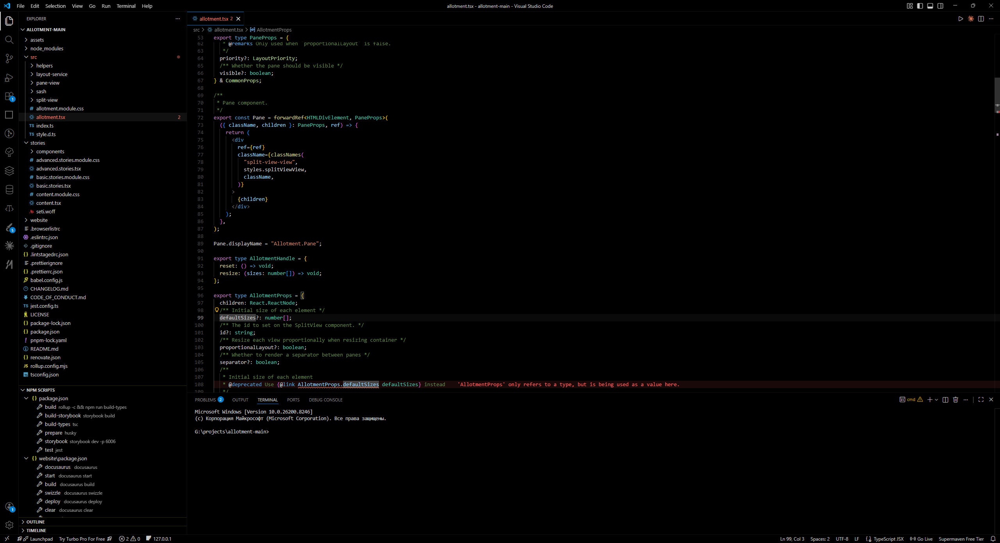

# VS 2019 Total Black Theme

A pure black dark theme for Visual Studio Code, inspired by the Visual Studio 2019 color scheme — redesigned with true black (`#000000`) backgrounds for maximum contrast and reduced eye strain, especially on OLED displays.

## Features

- **True black backgrounds** — editor, sidebar, activity bar, and panels all use `#000000`
- **VS 2019-inspired syntax colors** — familiar palette: blue keywords, cyan variables, teal types, yellow functions, orange strings
- **Optimized for OLED screens** — no dark gray compromises, pure black everywhere it counts
- **Clean UI** — minimal borders and subtle separators to keep the focus on your code

## Syntax Highlighting

| Element       | Color     |
|---------------|-----------|
| Keywords      | `#569CD6` (blue)    |
| Variables     | `#9CDCFE` (light blue) |
| Types/Classes | `#4EC9B0` (teal)    |
| Functions     | `#DCDCAA` (yellow)  |
| Strings       | `#CE9178` (orange)  |
| Comments      | `#608B4E` (green)   |

## Installation

1. Open **Extensions** in VS Code (`Ctrl+Shift+X`)
2. Search for `VS 2019 Total Black Theme`
3. Click **Install**
4. Open **Color Theme** picker (`Ctrl+K Ctrl+T`) and select **VS 2019 Total Black Theme**

## Feedback

Found a color that looks off? Open an issue — all feedback is welcome.
